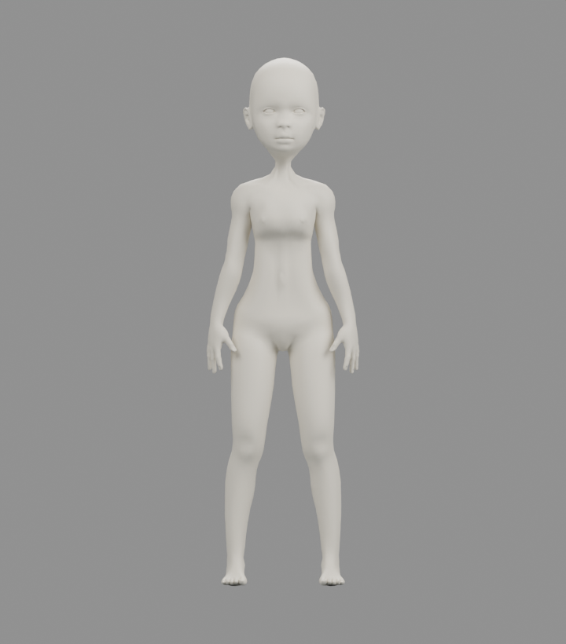
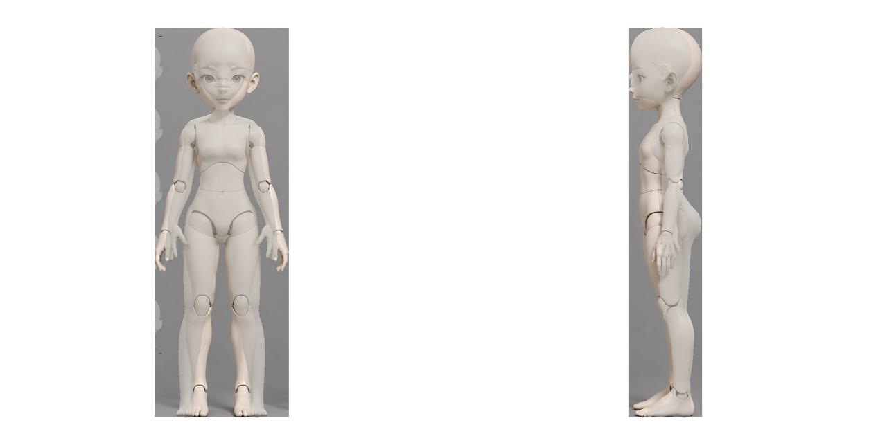

# ANNY 레퍼런스 비교 기준 결과 — 2026-09-23

사용자가 이번 결과를 기준 리포트로 보관하도록 지정한 모델·리그와 재현 사본이다. 정식 게임 에셋 등록을 의미하지 않는다. PDF는 생성하지 않았다.

[결과 비교 화면](snapshot/preview.html) · [입력 JSON](snapshot/inputs/attributes.json) · [Blender](snapshot/anny-raw-rig.blend) · [GLB](snapshot/anny-raw-rig.glb)




## 이번 기준까지의 과정
1. 새 첨부 JSON으로 기존 누적 체형 설정을 교체했다. gender 1, age 0.15, weight 0.25, height 0.25이며, muscle·proportions는 미지정 기본값 0.5다. age는 정규화 속성이고 실제 나이가 아니다.
2. 레퍼런스에 맞춰 팔을 내린 이전 피팅 포즈를 적용했다. 체형 설정과 포즈 입력을 분리해 보관한다.
3. 목 높이 measure-neck-height-incr를 1→0.5, 허벅지 upperlegs-height-incr와 종아리 lowerlegs-height-incr를 각각 0.5→0.7로 변경했다. neck-scale-vert-incr는 0.5 유지.
4. 사용자 재시도로 동일 설정을 새 경로에서 생성했다. 보관 원본은 .tmp/anny-neck-leg-length/2026-09-23_12-29-13이다.

## 결과 및 검증 범위
- ANNY 0.6.0, 13,718 정점, 27,420 삼각형, 104 본.
- 실측 약 5.625등신. 머리 꼭대기부터 턱 정점 5155까지 길이로 계산한다. 5등신 정확 일치를 주장하지 않는다.
- 메시 후보정·가중치 수정 없음. Blender 출력만 전신 높이 1.6m로 균일 정규화.
- 레퍼런스 전신 높이를 기준으로 정렬하고 모델 불투명도 60%로 합성. 측면은 발목 수평 위치 수동 정렬이며 ±5px 불확실성이 있다.
- GLB 재수입 정점 최대 오차 약 0.000000604m로 허용값 0.0001m 이내.
- 목이 가늘고 레퍼런스와 머리·몸통·사지 윤곽 차이가 남아 있다. 이번 기준은 검토 기준점이며 리깅 동작·애니메이션 자연스러움을 승인한 결과가 아니다.
- snapshot의 로그·generation.json·roundtrip-validation.json은 원본 실행 기록이다. verification은 보관 사본의 별도 재실행 검증이다.

## 재현
저장소 루트에서 실행한다. Python 3.12 환경의 ANNY 0.6.0·torch·numpy, .local/anny-runtime, .model/anny 캐시, CUDA가 필요하다. 렌더는 .local/blender-runtime의 bpy 4.5.3이 필요하다. 모델 가중치는 공유본에 포함하지 않는다. ANNY 라이선스는 snapshot/ANNY-LICENSE.txt 참조.

```bash
.venv/bin/python report/anny-reference-baseline-20260923/reproduce.py
.venv/bin/python report/anny-reference-baseline-20260923/reproduce.py --render
```

첫 명령은 보관 입력·코드로 CUDA 재생성 후 원본 NPZ 전체 배열을 비교한다. 두 번째는 렌더·GLB·오버레이도 생성한다. 출력은 새 .tmp/anny-report-replay/한국시간 경로이며 보관본은 수정하지 않는다. 다른 GPU·라이브러리 환경에서는 부동소수·렌더 차이가 생길 수 있다.

```bash
cd report/anny-reference-baseline-20260923
sha256sum -c checksums.sha256
```

## 보관 사본 재실행 결과

보관된 코드·입력으로 GPU 생성부터 6개 뷰·오버레이 렌더, GLB 검증까지 재실행했다. NPZ의 정점·면·본 행렬·부모·이름·가중치·인덱스 모두 원본과 정확히 일치했다. 렌더 실행 성공과 정적 GLB 검증을 확인했으며 렌더 픽셀의 완전 일치 여부는 검증하지 않았다. [검증 기록](verification/reproduction-validation.json)을 참조한다.
