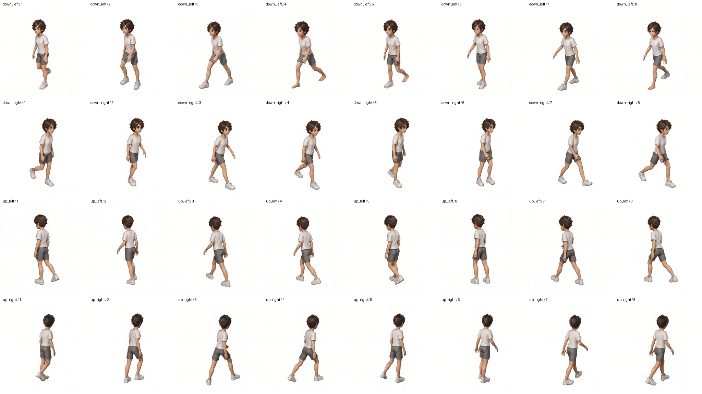

# v6 AnyPose 32프레임 실험 리포트

수평 45° MoMask 리그 v6를 참조하여 캐릭터 baseline-v2의 4방향 × 8프레임을 생성한 실험의 외부 공유용 사본이다. 원본은 `.tmp/2026-09-23_19-34-30_`이며 실행 당시에는 끝의 `_`가 없는 경로였다. 원본 로그와 결과 JSON의 과거 경로는 이력을 위해 그대로 보존했다.

## 과정과 설정

1. v6의 방향별 리그 시트를 512×512 프레임으로 분리했다.
2. 캐릭터 참조와 리그를 순서대로 입력했다. 좌상·우상에는 공통 보조 프롬프트를 적용했다.
3. Qwen-Image-Edit-2511 + AnyPose Base/Helper 각각 0.7 + Lightning 1.0, 4스텝, CFG 1, seed 10107로 생성했다.
4. 32개 결과의 완료 상태와 해상도를 확인하고 방향별 시트·GIF 및 전체 검수 시트를 만들었다.

모델 revision·어댑터 해시·Torch/Diffusers 버전은 각 `snapshot/<방향>/frame-XX/result.json`과 `snapshot/runtime-source/anypose.py`에 보관되어 있다. 출력은 512×512이며 참조 조건 영상은 384×384이다. 생성 실행은 2026-09-23 19:34경 시작해 20:08경 완료됐다.

## 결과와 한계



[4방향 보행 GIF](snapshot/anypose-v6-four-view.gif)

좌상·우상은 뒤통수 방향을 유지했다. 좌하 4·5·8번에서는 신발 소실이 확인됐다. 기술적 생성 완료를 품질 승인으로 간주하지 않으며 정식 캐릭터 에셋으로 채택하지 않았다. 이 리포트는 이후의 20·30·40스텝 실험을 포함하지 않는다.

## 사본 검증

원본과 사본 152개 파일의 SHA-256 일치를 확인했다. 32개 리그 참조와 4방향 캐릭터 참조도 실행 당시 result.json의 해시와 대조했다. 프롬프트 본문은 공유본에서 제외하고 해시·적용 여부만 보존했다. PDF와 모델 가중치는 포함하지 않는다.

```bash
cd report/anypose-v6-32frames-20260923
sha256sum -c checksums.sha256
```

## 재현 범위

`reproduce.py`는 보관된 런타임 코드와 입력 사본을 사용한다. 원래 `.tmp` 폴더가 없어도 검수와 입력 검증이 가능하다. GPU 재생성에는 호환 CUDA 환경, 기록된 모델·어댑터를 준비한 워크플로우 `.model` 디렉터리, 승인된 기본·보조 프롬프트 파일이 필요하다. 프롬프트는 실행 당시 해시와 일치해야 한다.

```bash
.venv/bin/python report/anypose-v6-32frames-20260923/reproduce.py \
  --workflow-root "$PWD" \
  --base-prompt /승인된/기본프롬프트.txt \
  --rear-prompt /승인된/보조프롬프트.txt \
  --verify-only
```

`--verify-only`를 제거하면 32프레임 GPU 재생성을 수행한다. GPU 실행은 샌드박스 밖에서 수행하고 로그를 새 실행 경로에 보관한다. 재현 출력은 `.tmp/test/anypose-report-replay/<한국시간>/`에 생성한다. 이번 리포트 제작에서는 사본 무결성과 32개 결합 프롬프트 해시만 확인했으며 GPU 재추론은 하지 않았다. 다른 GPU·라이브러리 환경에서 픽셀 단위 동일성은 보장하지 않는다.
