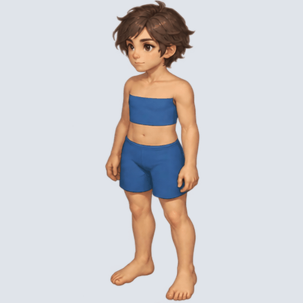
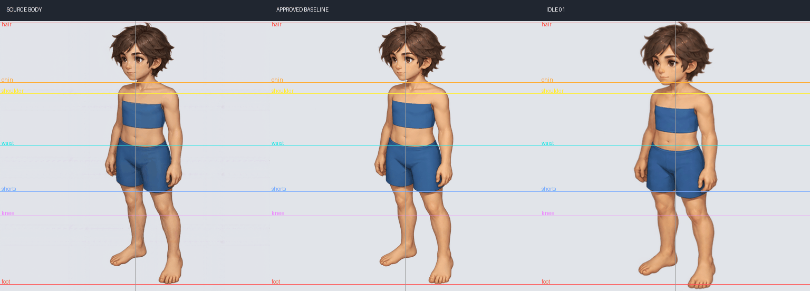

# 기본 캐릭터 바디 대기 8프레임 v2

승인한 단일 기준 프레임을 이미지젠 내장 도구로 8프레임 대기 호흡으로 확장한 검수 후보입니다.

- 정면좌측, 바디 베이스, 512×512 프레임 8장, 4열×2행 시트.
- 생성 원본은 generated.png, 크기 보정 후 시트는 default-body-idle-8frames.png입니다.
- review.gif는 회색 배경, 4 FPS·2초 반복입니다.
- approved-baseline.png는 사용자가 생성에 문제가 없다고 확인한 단일 프레임이며, source-body.png는 지정한 원본 바디 기준입니다.
- 원본 바디 출처: assets/character-baselines/character-default/separated-baseline-v3/body-base/down_left.png.
- 실행 출처: .tmp/test/imagegen-body-idle/2026-10-05_22-12-11/. 프롬프트·생성 원본·manifest·개별 프레임을 함께 보존하고 사본 해시를 원본과 대조했습니다.

## 검수 결과

단일 기준 프레임에 비해 8프레임 확장 결과의 머리가 커지고 허리·반바지 밑 위치가 내려가는 신체 비율 차이를 확인했습니다. **리포트 등록은 품질 승인이나 정식 에셋 채택을 의미하지 않습니다.**

가이드라인은 원본을 육안 판독한 비교 보조선이며 정밀 관절 검출 데이터가 아닙니다. 각 이미지는 전체 캔버스를 512×512로 환산하고 개별 체형·위치 보정은 하지 않았습니다.

[시트](default-body-idle-8frames.png) · [프롬프트](prompt.txt) · [전체 가이드 비교](baseline-guides-all.png)

