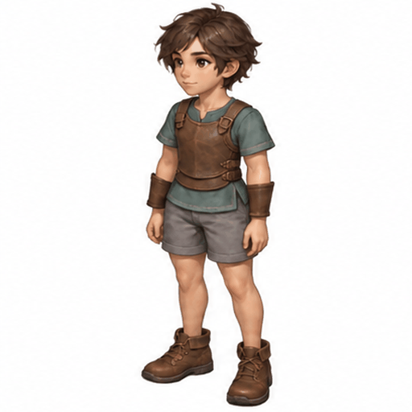

# 기본 캐릭터 · 가벼운 보호구 대기 8프레임 v1

내장 이미지젠으로 보호구 착용 베이스라인을 참조해 만든 정면 좌측 대기 호흡 검수 후보입니다.

- 참조 생성 ID: `2026-10-06_08-45-30-5f6f4fbb`.
- 4열×2행, 512×512 프레임 8장. 4fps·2초 반복.
- 생성 원본 1774×887을 전체 2048×1024로 리샘플링 후 등분했습니다. 개별 체형 변형·관절 재정렬은 하지 않았습니다.
- 신체 비율·얼굴·피부색·헤어·화풍·보호구를 유지하고 작은 호흡만 표현하도록 지시했습니다.
- 보호구 구성은 유지되지만 호흡 변화가 작고 베이스라인 대비 얼굴·체형 차이는 추가 검수가 필요합니다. 정식 에셋 채택은 아닙니다.
- 가이드라인은 육안 비교 보조선으로 정밀 관절 검출값이 아닙니다. 원본 포즈 맵을 새로 만들지 않았습니다.

[시트](idle-8frames.png) · [프롬프트 원문](prompt.txt) · [가이드 비교](baseline-guides-review.gif)

