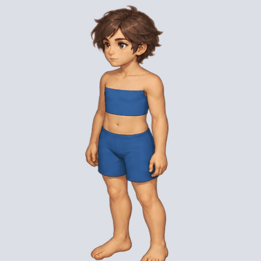
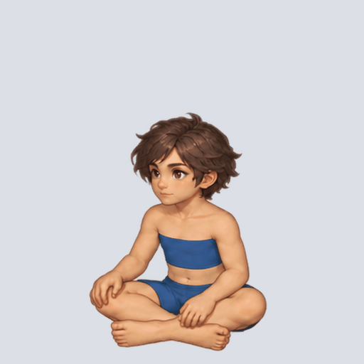

# 기본 캐릭터 바디 휴식 시작·종료 v1

사용자 요청으로 보존한 내장 이미지 생성기 검수 후보입니다. 리포트 등록은 정식 에셋 채택과 구분합니다.

- 휴식 시작: 서기 → 앉기, 8프레임.
- 휴식 종료: 앉기 → 일어서기, 8프레임.
- 정면좌측 바디, 프레임 512×512, 시트 2048×1024(4열×2행).
- 생성 원본 1774×887을 전체 시트 단위로 정규화한 뒤 분할했습니다. 개별 신체 비율은 보정하지 않았습니다.
- GIF는 회색 검수 배경이며 중간 프레임 250ms, 시작 650ms·마지막 850ms로 유지합니다.
- 원본 바디는 source-body.png, 승인한 단일 기준은 approved-baseline.png에 보존했습니다. 종료 생성은 시작 시트를 추가 참조했습니다.
- 출처: `.tmp/test/imagegen-body-rest/2026-10-05_22-17-46/`. 원본·프롬프트·manifest·개별 프레임을 복사하고 원본과 해시를 대조했습니다.
- 신체 비율과 시작·종료 연결 품질은 사용자 검수 대상입니다.

## 휴식 시작

[시트](rest-start-8frames.png) · [프롬프트](rest-start-prompt.txt) · [기록](rest-start-manifest.json)

## 휴식 종료

[시트](rest-end-8frames.png) · [프롬프트](rest-end-prompt.txt) · [기록](rest-end-manifest.json)

