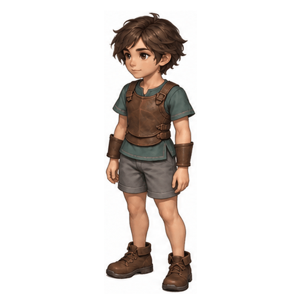

# 가벼운 보호구 휴식 시작·종료 v1

내장 이미지젠으로 각각 생성한 8프레임입니다. 정면 좌측, 서기 → 앉기 / 앉기 → 일어서기. 기존 바디 휴식 버전을 재사용하지 않았습니다.

- 각 프레임 512×512, 각 시트 4열×2행. 검수 GIF 4fps·2초.
- 전체 연결 GIF는 앉기와 서기 끝에서 각각 1초 대기합니다. 종료는 시작 파일의 역재생이 아닌 별도 생성입니다.
- 시작 원본은 행 경계가 불균등해 높이 56%에서 분리, 종료는 50%에서 분리했습니다. 각 내용 경계에 3px 여백을 두고 공통 1.05배로 리샘플링해 하단 y=500·가로 중앙에 배치했습니다. 좌위만 확대하거나 신체를 변형하지 않았습니다. 변환 좌표는 manifest에 기록했습니다.
- 기준: 보호구 레퍼런스 `2026-10-06_08-45-30-5f6f4fbb`. 종료 생성에는 시작 시트도 참조했습니다.
- 의상은 유지되지만 앉은 자세에서 카메라 방향·얼굴 비율 변화가 있습니다. 시작·종료 접속부의 자세와 크기가 완전히 일치하지 않아 검수 후보로 보존합니다.
- 가이드선은 서 있는 베이스라인의 육안 비교선이며 관절 정답이 아닙니다. 앉을 때 머리 높이가 내려가는 것은 정상입니다.

[시작 프롬프트](start-prompt.txt) · [종료 프롬프트](end-prompt.txt) · [시작 비교](start-guides.gif) · [종료 비교](end-guides.gif)

