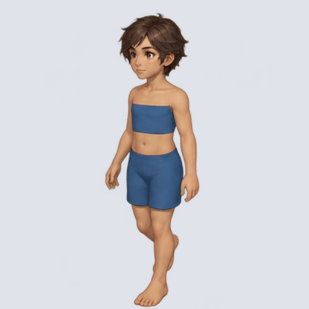

# 기본 캐릭터 바디 걷기 12프레임 v1

이미지젠 내장 도구로 생성한 검수 후보입니다. 기준 정체성은 identity-reference.png, 걷기 포즈 순서는 default-source.png를 사용했습니다. 원본 실행 결과는 상위 run/에 유지합니다.

- 정면좌측, 바디 베이스, 12프레임, 4열×3행.
- 생성 원본 1448×1086 RGBA를 2048×1536으로 리사이즈하고 512×512 셀로 분리했습니다. 네이티브 512 프레임 생성 결과는 아닙니다.
- 개별 PNG와 시트는 투명 배경입니다. 검수 GIF는 회색 배경, 120/130ms 교대 지연으로 평균 8 FPS·1.5초 반복입니다.
- 프롬프트 원문과 manifest를 함께 보존합니다. 캐릭터 일관성·동작 품질은 사용자 검수 대기이며 정식 에셋 채택은 아닙니다.
- 출처: .tmp/test/imagegen-body-identity/2026-10-05_21-51-34/. 사본은 원본 SHA-256과 대조했습니다.

[검수 GIF](default-body-down-left-review.gif) · [시트](default-body-down-left-12frames.png) · [프롬프트](default-prompt.txt)

