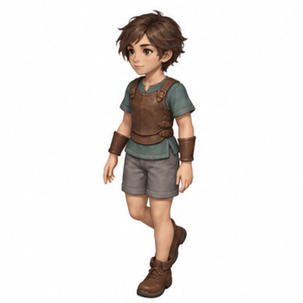
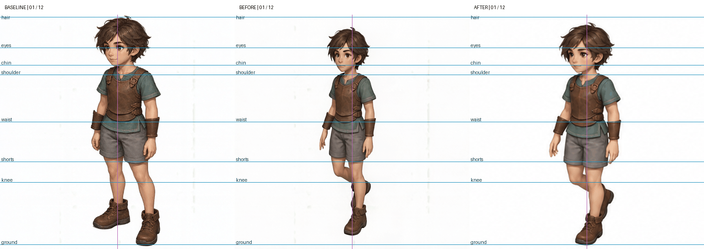

# 기본 캐릭터 경량 보호구 걷기 · 이미지젠 보정 v1

보호구 착용 베이스라인을 기준으로 12프레임의 체형·아이덴티티 이탈을 보정한 검수 후보입니다. 내장 image_gen 도구를 사용했습니다. 관리도구의 리그 노멀라이즈는 실행하지 않았습니다.

- 원천 작업: `2026-10-06_08-57-52-1dba9136`, 걷기 v13, 정면 좌측, ANNY, 4–27 구간·8fps·2배.
- 프레임 대응: 4, 6, 8, 10, 12, 14, 16, 18, 20, 22, 24, 26 → 1–12번, 행 우선 4열×3행.
- 참조: 경량 보호구 착용 결과 `2026-10-06_08-45-30-5f6f4fbb`.
- 생성 원본 1448×1086을 전체 동일 비율로 2048×1536으로 리샘플링한 뒤 512×512 셀로 분할했습니다. 512는 전달 셀 크기이며 원생성 셀은 362×362입니다. 개별 프레임의 체형·위치 강제 보정은 하지 않았습니다.
- GIF는 평균 8fps(120/130ms 교대), 12프레임·1.5초 반복입니다. GIF의 10ms 시간 단위 제약 때문에 교대 간격을 사용합니다.

## 검수

배경 세로 얼룩과 후반부 얼굴 방향의 차이는 줄었습니다. 보호구 색과 구성은 대체로 유지되지만 머리 크기·얼굴 표현과 체형의 정확한 일치는 미승인 상태입니다. 원본의 작은 팔 흔들림과 후반 유사 포즈가 유지되므로 걷기 연결 품질은 별도 판단해야 합니다.

가이드라인은 베이스라인의 육안 비교 보조선이며 관절 검출·리그 정답이 아닙니다. 걷기 자세에 따른 높이 변화가 있으므로 선과의 차이를 곧바로 체형 오류로 판정하지 않습니다. 오버랩은 동일 512 캔버스에서 50% 혼합한 것으로 관절별 정렬을 하지 않았습니다.

[검수 페이지](preview.html) · [12프레임 시트](normalized-12frames.png) · [전체 가이드 비교](baseline-guides-all.png) · [프롬프트 원문](prompt.txt) · [기록](manifest.yaml)

리포트 보존은 품질 승인이나 게임 에셋 채택을 의미하지 않습니다.
