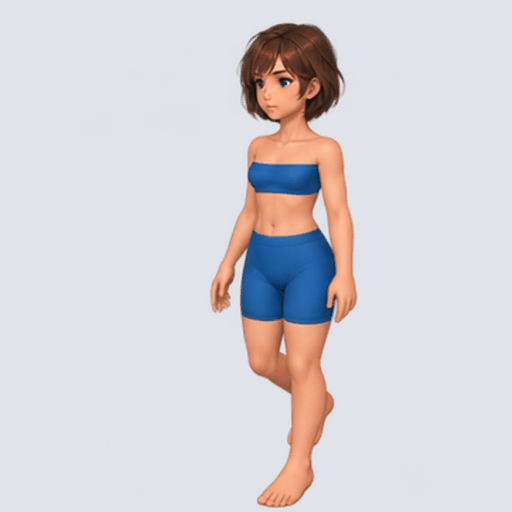

# 여성 A 바디 정체성 보정 v1

이미지젠 내장 도구의 검수 후보입니다. identity-reference.png를 캐릭터 정체성 기준, female-a-source.png를 걷기 포즈 순서 기준으로 사용했습니다.

- 정면좌측 바디 베이스, 12프레임, 4열×3행.
- 생성 원본 1448×1086 RGBA를 2048×1536으로 리사이즈하고 512×512 셀로 분리했습니다. 네이티브 512 프레임 생성 결과는 아닙니다.
- 시트·개별 PNG는 투명 배경입니다. GIF는 회색 배경, 120/130ms 교대 지연으로 평균 8 FPS·1.5초 반복입니다.
- 프롬프트·manifest와 생성 원본을 보존합니다. 품질 검수 대기이며 정식 에셋 채택은 아닙니다.
- 출처: .tmp/test/imagegen-body-identity/2026-10-05_21-51-34/. 보존 사본은 원본 SHA-256과 대조했습니다.

[검수 GIF](female-a-body-down-left-review.gif) · [시트](female-a-body-down-left-12frames.png) · [프롬프트](female-a-prompt.txt)

