# 기본 캐릭터 대기 애니메이션 샘플

사용자가 지정한 두 생성 기록의 방향별 결과를 조합한 워크플로우 검수용 보관본이다.

[동기 재생 및 전체 프레임 보기](index.html) · [출처 및 SHA-256](manifest.yaml)

| 방향 | 생성 기록 | 모션 |
| --- | --- | --- |
| 전방 좌측 | `2026-09-27_17-19-41-796ec3dd` | `standing-v9` |
| 전방 우측 | `2026-09-27_17-19-41-796ec3dd` | `standing-v9` |
| 후방 좌측 | `2026-09-27_17-19-41-796ec3dd` | `standing-v9` |
| 후방 우측 | `2026-09-27_21-05-00-34bd3a5f` | `standing-v10` |

## 구성과 검수 범위

- 방향별 원본 프레임 1·5·9·13번, 총 16장. 원본 PNG를 변환 없이 복사했다.
- 512×512, Lightning 4스텝, 생성 배속 4, 재생 4 FPS. 방향별 1초 분량을 반복한다.
- 두 기록 모두 completed 상태다. 서로 다른 모션 버전의 결과를 사용자 지정대로 조합했으며, 단일 실행 결과로 취급하지 않는다.
- 짧은 대기 샘플이며 전체 목 스트레칭 동작이나 마지막→첫 프레임의 완전한 루프 연결 품질을 보증하지 않는다.
- 이 리포트는 워크플로우 보관본이다. 게임 런타임 등록은 수행하지 않았다.
- 원본 생성 기록은 변경하지 않았다. 내부 프롬프트 원문은 복제하지 않고 원본 요청 파일 해시를 기록했다.

## 방향별 산출물

### 전방 좌측

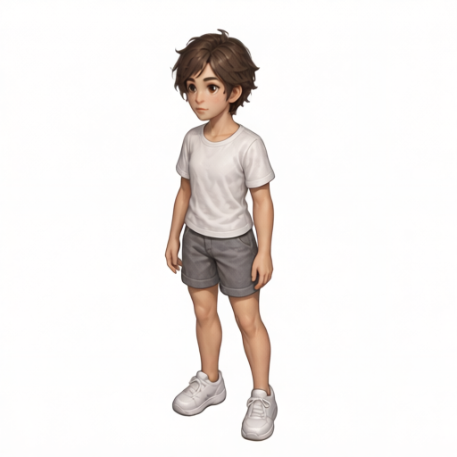

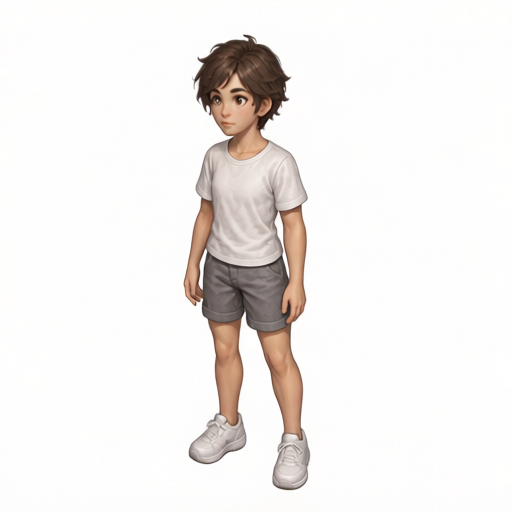

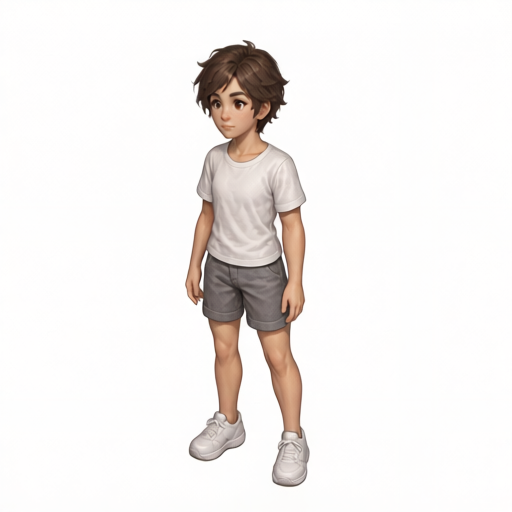

### 전방 우측

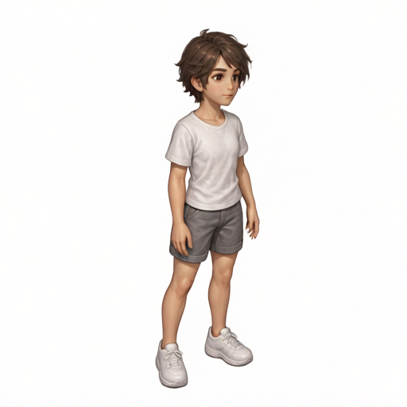

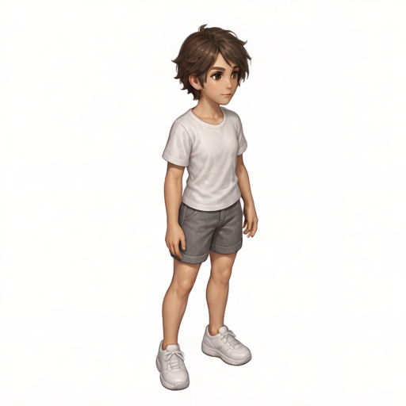

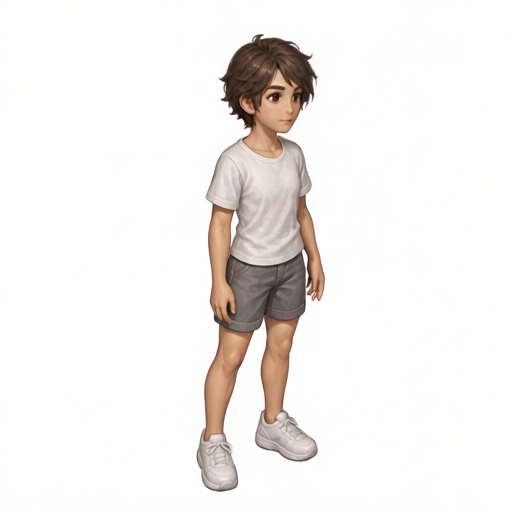

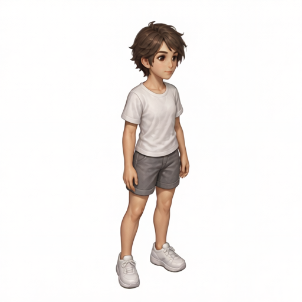

### 후방 좌측

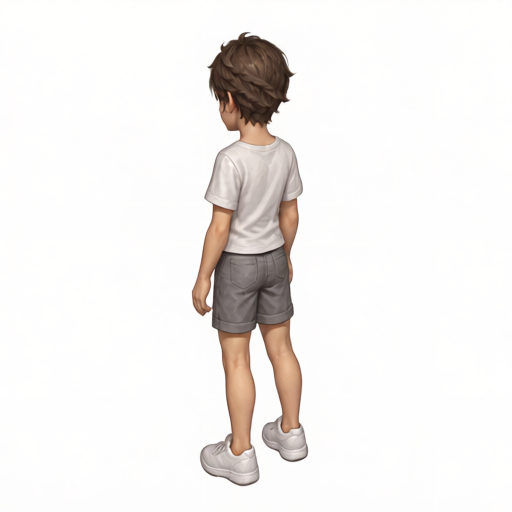

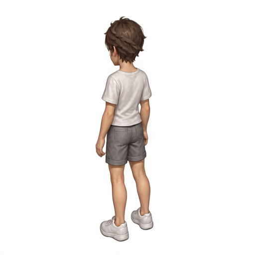

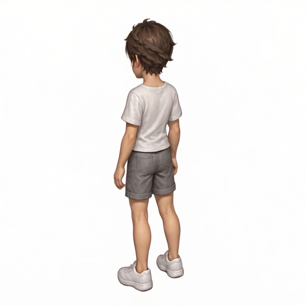

### 후방 우측

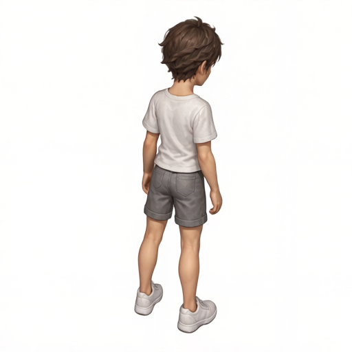

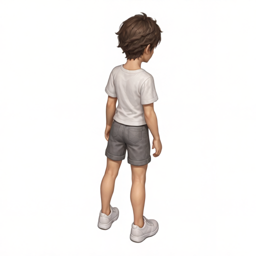

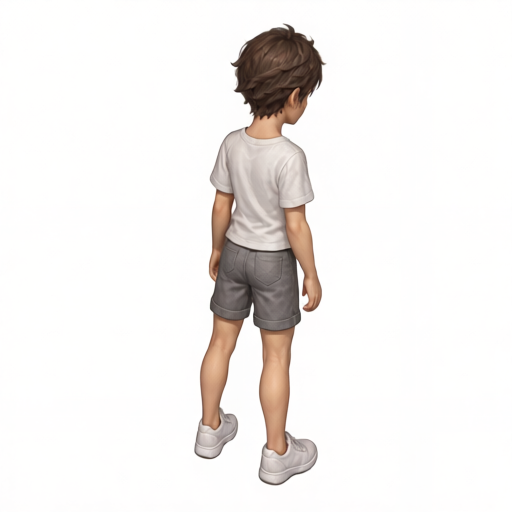

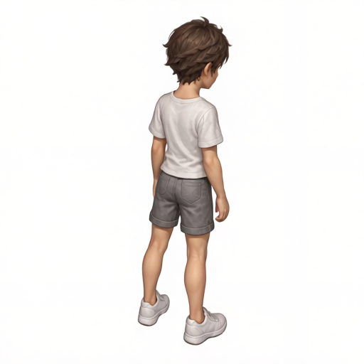

