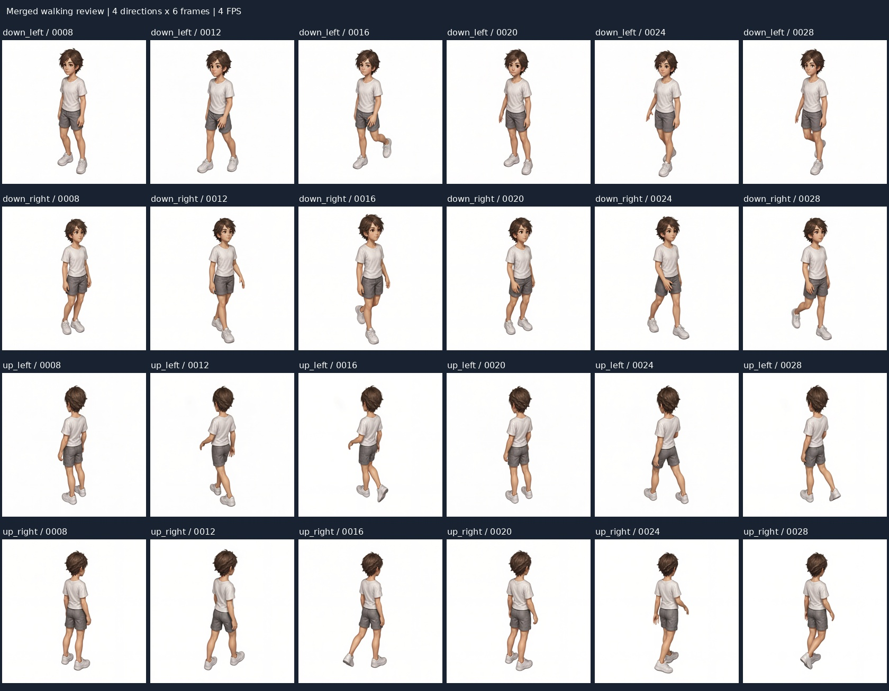

# 기본 캐릭터 걷기 병합 검수 리포트

사용자가 사용 가능한 조합으로 판단한 생성 결과를 방향별로 병합한 검수 보관본이다.

[동기 재생](index.html) · [출처·SHA-256](manifest.yaml)

## 채택 구성

| 방향 | 생성 ID | 장수 |
| --- | --- | --- |
| 전방 좌측 | `2026-09-27_22-28-43-78d4c5bc` | 6 |
| 전방 우측 | `2026-09-27_22-28-43-78d4c5bc` | 6 |
| 후방 좌측 | `2026-09-27_22-28-43-78d4c5bc` | 6 |
| 후방 우측 | `2026-09-28_09-11-42-b953d576` | 6 |

- 모션 `walking-v13`, 기본 캐릭터, ANNY 참조, 512×512, Lightning 4스텝.
- 시작 8·종료 29, 생성 배속 4, 원본 프레임 8·12·16·20·24·28을 사용했다.
- 총 24장. 방향별 4 FPS, 1.5초 반복 미리보기를 제공한다.
- 이전 후방 우측 6장은 이 병합본에서 제외하고 새 실행의 6장으로 대체했다.
- 원본 PNG는 재가공 없이 복사했으며 원본 생성 기록은 보존했다.
- 새 실행에서는 기본 프롬프트의 방향 표현을 제거하고 걷기 후방 우측 추가 지시를 압축했다. 실행별 요청 해시로 출처를 구분한다.
- 이 문서는 병합 결과의 검수·보관 리포트다. 프론트엔드 에셋 등록이나 앵커 설정은 포함하지 않는다.
- 마지막→첫 프레임 연결과 방향 전환의 자연스러움은 아래 재생 화면에서 추가 검수할 수 있다.

## 전체 프레임

위에서부터 전방 좌측·전방 우측·후방 좌측·후방 우측, 왼쪽부터 8·12·16·20·24·28번이다.

