# 여성 캐릭터 좌하 걷기 생성 리포트

생성 ID: `2026-10-03_11-50-21-e7ce5f25`

- 생성 상태: 완료
- 캐릭터: 여성 캐릭터 (`character-female`)
- 동작: `walking-v13` · 좌하 방향
- 결과: 512×512, 12프레임, 8 FPS, 재생 길이 1.5초
- 생성 설정: 2배속 샘플링, 4스텝, Qwen Image Edit 2511
- 원본 모션 구간: 4–26프레임, 2프레임 간격
- 검수 상태: 사용자 검수 대기. 정규화·정식 에셋 등록 전 원본 생성 결과입니다.

[요청](request.json) · [결과](result.json) · [출처와 파일 해시](manifest.yaml)

## 프레임

| 순서 | 원본 프레임 | 생성 결과 |
|---|---|---|
| 1 | 4 | 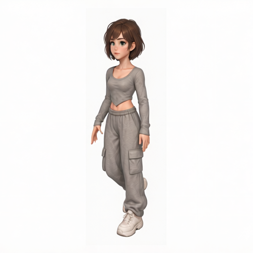 |
| 2 | 6 | 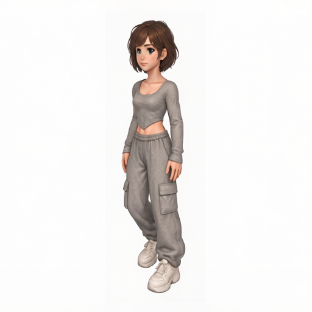 |
| 3 | 8 | 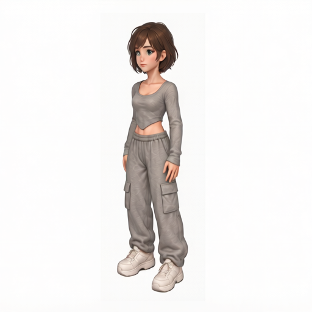 |
| 4 | 10 | 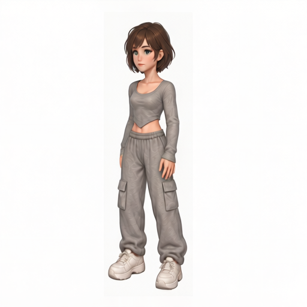 |
| 5 | 12 | 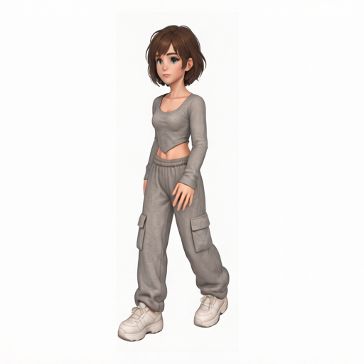 |
| 6 | 14 | 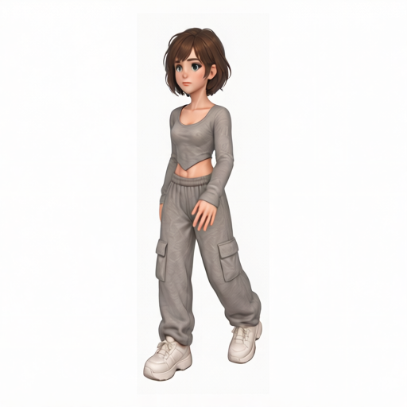 |
| 7 | 16 | 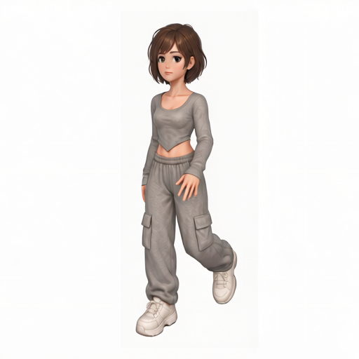 |
| 8 | 18 | 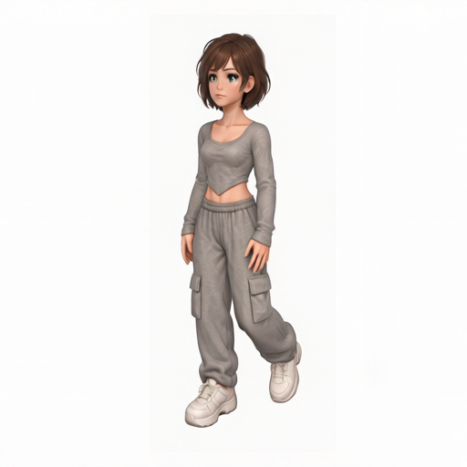 |
| 9 | 20 | 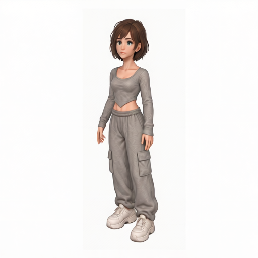 |
| 10 | 22 | 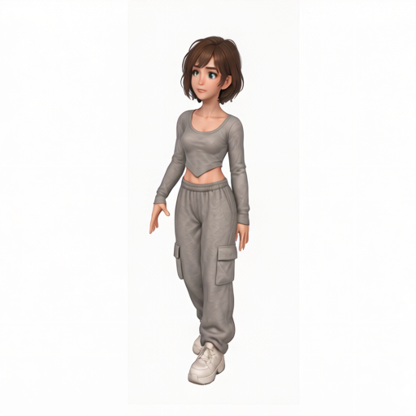 |
| 11 | 24 | 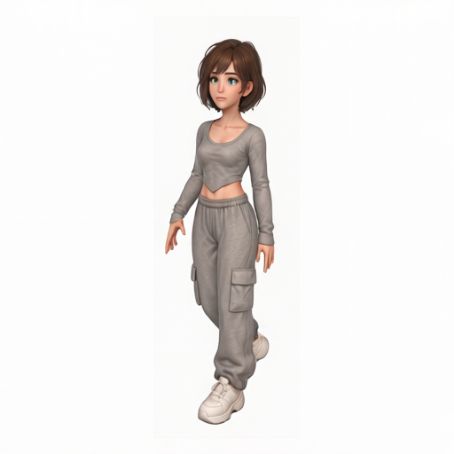 |
| 12 | 26 | 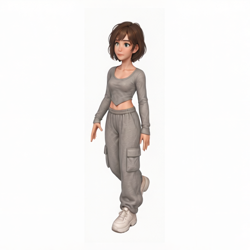 |
