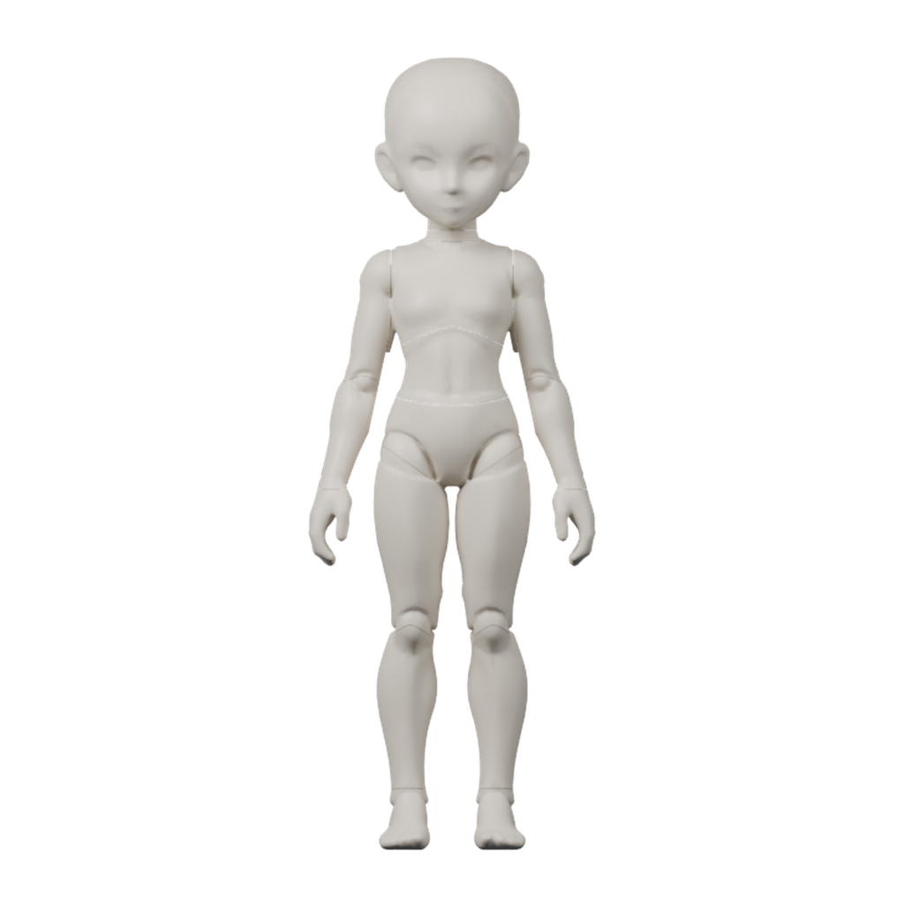

# 마네킨 외형 보존과 구체관절 리그 실험

외부 공유용 **특정 실험의 이력과 결과 사본**이다. 대상은 2026-09-23 06:25:15에 시작한 마네킨 외형 보존 수정안이며, 입력 모델과 모션을 함께 보관하여 원래 `.tmp` 폴더 없이 리그 제작을 재실행할 수 있다. PDF는 포함하지 않는다.

## 바로 확인

- [비교와 보행 미리보기](snapshot/preview.html): 정면·측면·후면, 레퍼런스 겹쳐보기, 4방향 보행.
- [Blender 원본 사본](snapshot/rigged-mannequin.blend) / [보행 GLB 사본](snapshot/rigged-mannequin.glb).
- [리그 검사](snapshot/validation.json) / [GLB 검사](snapshot/export-validation.json).
- [사본 재생성 검증](verification/reproduction-result.json) / [재현 실행 로그](verification/execution.log).
- [SHA-256 목록](checksums.sha256): 공유본 파일의 무결성 확인.



## 실험 진행 이력

| 단계 | 실행과 관찰 | 보관 근거 |
| --- | --- | --- |
| 3방향 입력 준비 | 동일 레퍼런스 시트의 정면·왼쪽 측면·후면을 원본 픽셀로 크롭. GrabCut 배경 분리 후 높이 900px, 발바닥 기준선 964px로 정렬 | `inputs/reference-sheet.png`, `inputs/{front,left,back}.png`, `history/input-preparation.json` |
| 다중 시점 형상 생성 | `tencent/Hunyuan3D-2mv`, revision `3a761b539b29fe4ff64714813aa9560fd66f5de0`, seed 20260923, 75 steps, octree 512. 원시 메시 233,066 정점 / 466,132 삼각형 | `history/generation.json`, `history/generation.log` |
| 채택 모델 정리 | 생성 형상의 원래 비율을 보존하고 전체 높이 2.0으로 균일 정규화, 약 30,000 삼각형으로 축소한 검수 모델 | `inputs/accepted-mannequin.blend`, `history/render_model.py`, `history/render.log` |
| 이전 관절형 | 독립 구체와 몸통 분할이 크게 드러나 채택된 외곽과 차이가 커짐 | `inputs/previous-mannequin.blend`, `snapshot/aligned-previous-*.png` |
| 외형 보존 수정 | 채택 모델의 표면에서 좁은 곡선 경계로 분할. 내부 구체의 외부 노출을 줄이고, 원본 외부 노멀 보존. 안쪽 0.0015 두께의 셸 적용 | `source/build_parts.py`, `snapshot/build*.log` |
| 연결부 개선 | 외곽 연결부만 최대 두 본 가중치를 혼합하고 내부 구체는 단일 본 강체로 유지 | `source/refine_weights.py`, `source/build_rig.py` |
| 모션 적용·검수 | `mannequin-walk/v1`을 리타게팅. 골반·쇄골 보조 본과 발 지면 보정 적용. 25개 키프레임 및 GLB 검사 | `inputs/mannequin-motion.npz`, `snapshot/result.json`, `snapshot/validation.log` |
| 외부 공유 사본 | 필요한 입력·원본 코드·출력·로그를 복사. 입력 사본부터 형상 분할과 리그·GLB를 다시 생성해 수치 비교 | `reproduce.py`, `verification/` |

원래 수정 실험의 반복 로그는 `build.log → build-surface-fixed.log → build-normals.log → build-blended.log → build-shells.log → build-final.log` 순서다. **중간 버전의 코드 전체가 각각 보존된 것은 아니므로 모든 중간 단계를 독립적으로 재생성할 수 있다는 의미는 아니다.** `source/`는 최종 코드 스냅샷이며, `render_details.py`는 이번 최종 렌더에 사용하지 않은 보조 코드다.

## 결과와 해석

- 30개 독립 메시, 24개 본, 내벽 포함 81,744 삼각형.
- 20fps, 1.2초 보행 루프. 1~24번이 루프, 25번은 시작 자세와 같은 보간용 키프레임.
- 내부 구체 변 길이 최대 오차 `2.313e-7`, 관절 중심 `2.833e-7`, 지면 최저 정점 높이 `1.453e-7`, 루프 시작·끝 정점 차이 `0`.
- 채택된 **3D 모델**과의 실루엣 IoU: 정면 99.463%, 측면 99.995%, 후면 99.466%. 레퍼런스 그림과의 디자인 유사도 점수가 아니다.
- 얼굴 인상·손발 디테일, 극단 각도 간섭, 발 미끄러짐, 손가락 제어, 추가 모션은 별도 검수 대상이다. 실물 구체관절 인형의 공차·내부 고정 구조는 설계하지 않았다.
- 현재는 외형 검수 후보다. 이번 기록과 공유 사본 생성은 정식 에셋 등록이나 게임 런타임 채택을 의미하지 않는다.

## 폴더 구성

| 경로 | 용도 |
| --- | --- |
| `snapshot/` | 최종 결과·비교 이미지·미리보기·로그의 원본 사본. 기존 provenance의 경로는 당시 이력이며 현재 실행 의존성이 아니다. |
| `inputs/` | 채택 모델, 이전 비교 모델, 기준 모션과 해시 manifest, 레퍼런스 입력 사본. |
| `source/` | 최종 제작·검증 코드의 변경하지 않은 사본. 당시 절대 경로를 포함하므로 직접 실행하지 않는다. |
| `history/` | 앞선 Hunyuan 입력 준비·형상 생성·모델 정리의 코드와 실행 기록. 추적 자료이며 독립 실행 패키지는 아니다. |
| `reproduce.py` | 입력 경로를 사본으로 교체하고 새 폴더에서 최종 형상·리그·GLB를 재생성하는 실행기. |
| `verification/` | 재현 성공 기록과 로그, 재현 초기 실패 기록. 재생성된 대형 바이너리는 새 `.tmp` 실행 폴더에 남긴다. |

공유할 때 이 폴더 전체를 복사한다. `snapshot/preview.html`의 이미지와 링크는 상대 경로라 함께 이동할 수 있다. 비공개 프롬프트와 모델 가중치는 포함하지 않았다.

## 사본에서 재현하는 방법

확인 환경: Linux, Python 3.11.16, `bpy==4.5.3`, `numpy==1.26.4`. 필요한 패키지가 없으면 즉시 실패한다. 아래 명령은 워크플로우 저장소 루트에서 실행한다. 다른 환경에서는 첫 실행 파일을 동일 버전 패키지가 설치된 Python으로 바꾼다.

```bash
# 공유본 무결성만 검사
.local/blender-runtime/bin/python report/mannequin-reference-preservation-20260923/reproduce.py --verify-only

# 사본 입력부터 리그와 GLB를 재생성하여 원래 결과와 비교
.local/blender-runtime/bin/python report/mannequin-reference-preservation-20260923/reproduce.py \
  --output ".tmp/mannequin-reproduction/$(TZ=Asia/Seoul date +%Y-%m-%d_%H-%M-%S)"
```

이미 존재하는 출력 폴더나 이 공유 폴더 내부를 출력 대상으로 지정하면 실패한다. 제작·검증 로그와 `reproduction-result.json`은 새 출력 폴더에 저장된다. 단계별 로그와 5초 간격 heartbeat를 남긴다.

실행 순서는 **파일 해시 검사 → 입력 사본 복사 → 원본 코드의 입력 경로 교체 → 표면·구체·가중치·리그 생성 → GLB export → 25프레임 리그 검사 → GLB 검사 → 기존 결과와 비교**다. 원본 코드에서 GPU 렌더 구간만 제외하며, 형상·가중치·모션 계산은 변경하지 않는다. Python `bpy`의 종료 정체를 피하기 위해 단계 스크립트를 별도 프로세스에서 실행하고, 완료 후 출력 스트림을 flush하고 종료한다. 예외는 traceback과 실패 종료 코드로 전파한다.

### 재현 판정 기준

- 사본 파일: SHA-256 일치.
- GLB: JSON 구조 일치, 전체 238개 accessor 비교. 삼각형은 정점 연결과 winding을 유지한 채 나열 순서만 정규화하여 비교.
- 좌표·가중치·애니메이션 수치: 절대 허용 오차 `1e-6`, 상대 허용 오차 `0`.
- 노멀 성분: 허용 오차 `1e-4`. 재실행에서 최대 `7.475e-5` 차이가 관찰되어 따로 기록한다.
- 리타게팅 모션과 리그에서 추출한 모션: 필드·형상 일치, 수치 허용 오차 `1e-6`.
- `.blend` 파일의 바이트 동일성, GPU 렌더 픽셀 동일성, Hunyuan 추론의 재생성은 판정하지 않는다. Hunyuan 단계는 모델 revision·입력·파라미터·로그를 보관한 범위다.

### 재현 중 확인된 차이

첫 실행은 모델 생성 후 `bpy` 종료 단계에서 정체되어 중단했다. 두 번째 실행은 리그·GLB 자체 검사를 통과했으나 삼각형 나열 순서와 일부 노멀 차이 때문에 바이트에 가까운 비교가 실패했다. 연결 구조와 winding이 같음을 확인한 뒤 위 기준으로 비교했다. 초기 실패 기록도 `verification/`에 남겼다.

성공 실행에서 좌표·가중치·애니메이션 및 모션 차이는 `0`이며, 삼각형 연결과 winding은 같다. GLB의 SHA-256은 원본과 다르므로 **파일 바이트 동일이 아닌 명시된 수치 기준의 재현 성공**이다. 최종 측정값과 실행 환경은 [재현 검증 기록](verification/reproduction-result.json)을 기준으로 한다.

최종 검증은 공유 폴더를 `/tmp/mannequin-share-relocation-20260923`로 옮긴 사본에서 2026-09-23 07:00:52 KST에 실행했다. 원래 실험 폴더를 입력으로 읽지 않으며, 출력은 별도 `.tmp/mannequin-reproduction/2026-09-23_07-00-52`에 생성했다. 238개 accessor 비교, 25프레임 검사, 두 모션 NPZ 비교가 통과했다. 최종 실행의 노멀 최대 차이도 `0`이고, 12개 index accessor의 삼각형 나열 순서만 다르다.
